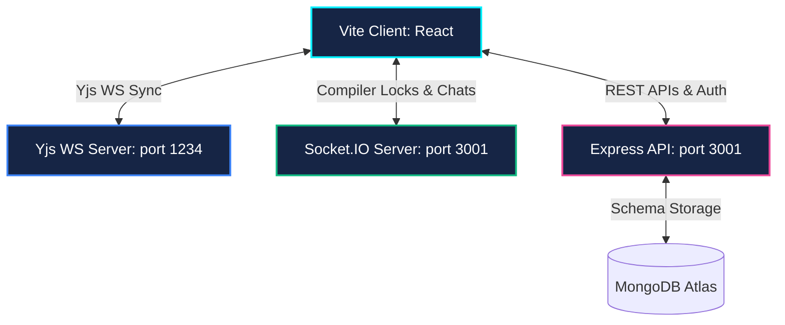

# CollabCode 🚀

CollabCode is an ultra-premium, real-time collaborative pair programming environment built for seamless developer teamwork. Featuring conflict-free character synchronization, in-app sandboxed terminal compilers, private room text chats, and high-fidelity administrative monitoring dashboards.

---

## 💎 Core Capabilities

### 1. 🌓 Soft Light & Dark Themes
* Seamless visual toggles across both deep space dark modes and soft grid light themes.
* Auto-synchronizes visual states dynamically with the underlay Monaco Editor instance.

### 2. ⚡ Real-Time Operational Synchronization (Yjs)
* Lag-free, conflict-free editing handled natively on Yjs WebSocket hubs.
* Radiant colored cursors showing exact teammate selections and text highlights in real-time.

### 3. 💬 Collaborative Workspace Dock
* **Room Text Chat Drawer**: Interactive bubble text conversations synced via Socket.IO, featuring user initial badges, timestamps, and system alerts (e.g. *"Alex Chen joined the room"*).
* **Monaco Preferences Panel**: Sliders and selectors to customize font sizes (12px to 24px), word wrapping, tab indents, auto-closing brackets, and minimap visibility, persisting natively to local storage.
* **Collaborator listings**: Real-time tracking of active room participants.

### 4. 🛡️ Administrative Shield Console (`/admin`)
* **Role-Based Clearance Gates**: Gated API middleware that restricts room-joining and workspaces entirely to standard users, routing administrators directly to secure metrics panels.
* **Interactive SVG Charts**: Dynamic vector statistics detailing user tiers (Donut segment segments) and review scores (Bar distributions) that redraw reactively upon deletion.
* **Profile & Review Purging**: Full database control panels to delete reviews or drop stale user profiles.

### 🔑 5. Session Verification & UX Redirections
* **Database Mount Verification**: frontend pings the GET `/api/auth/me` endpoint upon load. If the browser holds a stale token (e.g., from dropped user collections), it purges credentials automatically.
* **Clickable Redirection Logos**: Logo header brandings double as navigational `<Link to="/">` paths.
* **Prominent Feedback Banners**: Highly accessible reviews callouts embedded right inside the login cards and landing pages.

---

## 🛠️ The Architecture System



* **Frontend**: React.js, Vite 6, Tailwind CSS v4, Monaco Editor, Socket.IO Client.
* **Sync Core**: Yjs, Y-Websocket, Y-Monaco (for conflict-free characters merging).
* **Backend**: Node.js, Express, MongoDB & Mongoose.

---

## 🚀 Development Setup

### 📦 Prerequisites
* Node.js (v18+)
* MongoDB Local or Atlas URI

### 1. Backend API & WebSockets Setup
Create a `.env` file inside `/backend`:
```env
PORT=3001
MONGO_URI=mongodb://localhost:27017/collabcode
JWT_SECRET=your_super_secure_secret_key
JWT_EXPIRES_IN=7d
FRONTEND_URL=http://localhost:5173
```
Install dependencies and run the server:
```bash
cd backend
npm install
npm run start
```

### 2. Yjs Sync WS Server Setup
Start the yjs websocket sync relay:
```bash
cd backend
npm run start-yjs
```

### 3. Frontend Client Setup
Install packages and start the Vite development server:
```bash
cd frontend
npm install
npm run dev
```

Open `http://localhost:5173` in your browser.

---

## 🔑 User Onboarding Clearance
* **Standard User**: Normal access to landing, login, feedback, and collaborative rooms.
* **Administrator**: Cleared to view overall stats and directory tables inside `/admin`. Gated away from joining workspace rooms to protect server synchronization slots. Select **Administrator** in the **Role Clearance** dropdown during registration to clear an admin profile.
